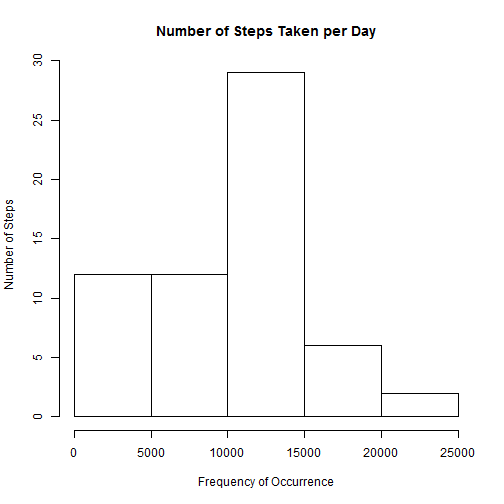

Reporoducible Research - Course Project 1
===============================================================================================================================

#Introduction
This analysis was completed to answer the questions posed in Peer Assignment 1 of the Reproducible Research Course on the Coursera Data Science Specialisation. The questions all revolve around a data set that contains information on the number of steps that a particular test subject takes over the course of the trial period. This particular trial was run from October 1, 2012 to November 30, 2012.

Analysis was completed using R version 3.1.2 on a PC running Windows 8.1.

#Analysis
##Loading the Data
The first step of the analysis is to load libraries that will be used, load the data into R, and create any objects that will be used. The dplyr package was used in this analysis and an empty object 'n' is created for later use as a counter. The data set is also loaded into R from the working directory:


```r
library(dplyr)
  n <- 0
  act <- read.csv("activity.csv", header = TRUE)
```

##Question 1
The first question is "What is the mean number of steps taken per day?" To answer this, I removed the "NA" values from the data set and then group the dataset by the date and use the summarise function to calculate the number of steps for each day:


```r
  act2 <- act[!is.na(act$steps),]
  
  actdate <- group_by(act2, date)
  
  actsum <- summarise(actdate, steps = sum(steps, na.rm = TRUE))
  hplot <- as.numeric(actsum$steps)
```

I then analysed this data to get the mean and median steps taken per day:


```r
  cat("Mean: ", mean(hplot), "\nMedian: ", median(hplot))
```

```
## Mean:  10766.19 
## Median:  10765
```

I also generated a histogram of the number of steps take per day to aid in visualising the data:


```r
hist(hplot, main = "Number of Steps Taken per Day", ylab = "Number of Steps", xlab = "Frequency of Occurrence")
```

 

##Question 2
Question 2 asks "What is the Daily Activity Pattern?". By grouping the original data set by the interval during the day which the data was collected and then calculating the mean number of steps for each interval using the summarise function, I was able to create a time plot of the data:


```r
  actint <- group_by(act2, interval)
  actavg <- summarise(actint, steps = mean(steps, na.rm = TRUE))
  
  plot(actavg$interval, actavg$steps, type = "l", main = "Average Steps per Interval", xlab = "Interval", ylab = "Number of Steps")
```

 

I was also able to determine which interval is, on average, the most active interval in the day:


```r
  actavg <- as.matrix(actavg)  
  cat("\nMost Active Interval: ", actavg[which.max(actavg[,2]),1])
```

```
## 
## Most Active Interval:  835
```

##Question 3
The third question asks us to find a way to account for the missing data in the set. I chose to replace any "NA" values with the average value for the interval that was missing.

I started by determining how many values were "NA" by scanning the data for "NA" values and using a counter to track each "NA" value:


```r
 for (i in 1:dim(act)[1]) {
    if (is.na(act[i,1]) == TRUE) {
      
      n <- n + 1
      
    } 
  }
  
  cat("\nNumber of NA Values in Sample: ", n)
```

```
## 
## Number of NA Values in Sample:  2304
```

I then replaced all of the "NA" values by scanning the document again for each "NA" value and, when I located the value, searching the vector of average values used in Question 2 to find the average value for that interval. I then replaced the value for that interval. In the original data set with the average number.


```r
  corsteps <- act$steps
  
  for (i in 1:dim(act)[1]) {
    
    if (is.na(act[i,1]) == TRUE) {
      
      int <- act[i,3]
      
      for ( i in 1:dim(actavg)[1]) {
        
        if (int == actavg[i,1]) {
        
            corsteps[i] = actavg[i,2]
            break
        
        } 
      }
    }
  }
```

I then took the corrected step data and put it back together with the other data from the original data set and grouped everything by the date.

Once again using the summarise function, I created a histogram of the data and calculated the new Mean and the new Median:


```r
  date <- sapply(act$date, as.POSIXct)
  act3 <- data.frame(steps = as.integer(corsteps), date = as.factor(date), interval = as.integer(act$interval))
                    
  act2date <- group_by(act3, date)
  
  act2sum <- summarise(act2date, steps = sum(steps, na.rm = TRUE))
  hplot2 <- as.numeric(act2sum$steps)
  
  hist(hplot2, main = "Number of Steps Taken per Day", ylab = "Number of Steps", xlab = "Frequency of Occurrence")
```

 

```r
  #cat("Mean: ", mean(hplot2), "\nMedian: ", median(hplot2))
```

##Question 4

Question 4 asked what the impact is between weekends and weekdays on activity levels. I started off by identifying which of the days were weekdays and which were weekends by scanning the data with a for loop and checking to see if the day of the week natched a the name of a weekday. I then created a vector with this infomration in it and merged it with the original data set and subsetted the data into two separate data frames; one of which was subsetted for weeekdays and one of which was subsetted for weekends.


```r
  wday <- weekdays(as.Date(act$date, origin = "1970-01-01"))
  weekdays <- c("Monday", "Tuesday", "Wednesday", "Thursday", "Friday")
  
  for ( i in 1:length(wday)) {
    if (wday[i] %in% weekdays) {
      
      wday[i] = "weekday"
      
    }  
    else {
      
      wday[i] = "weekend"
   
    }   
  }
  
  act4 <- data.frame(act3, wday)

  Week <- subset(act4, wday == "weekday")
  Wend <- subset(act4, wday == "weekend")
```

From here, I grouped each subsetted vector by interval and calculated the average number of steps taken during that time with the summarise function.


```r
  Weekint <- group_by(Week, interval)
  Weekavg <- summarise(Weekint, steps = mean(steps, na.rm = TRUE))

  Wendint <- group_by(Wend, interval)
  Wendavg <- summarise(Wendint, steps = mean(steps, na.rm = TRUE))
```

From here I was able to generate a pair of plots looking at the average steps per interval during the weekends and another looking at the weekdays:


```r
  par(mfrow = c(2,1))
  
  plot(Weekavg$interval, Weekavg$steps, type = "l", main = "Average Steps per Interval - Weekdays", xlab = "Interval", ylab = "Number of Steps")
  plot(Wendavg$interval, Wendavg$steps, type = "l", main = "Average Steps per Interval - Weekends", xlab = "Interval", ylab = "Number of Steps")
```

 
